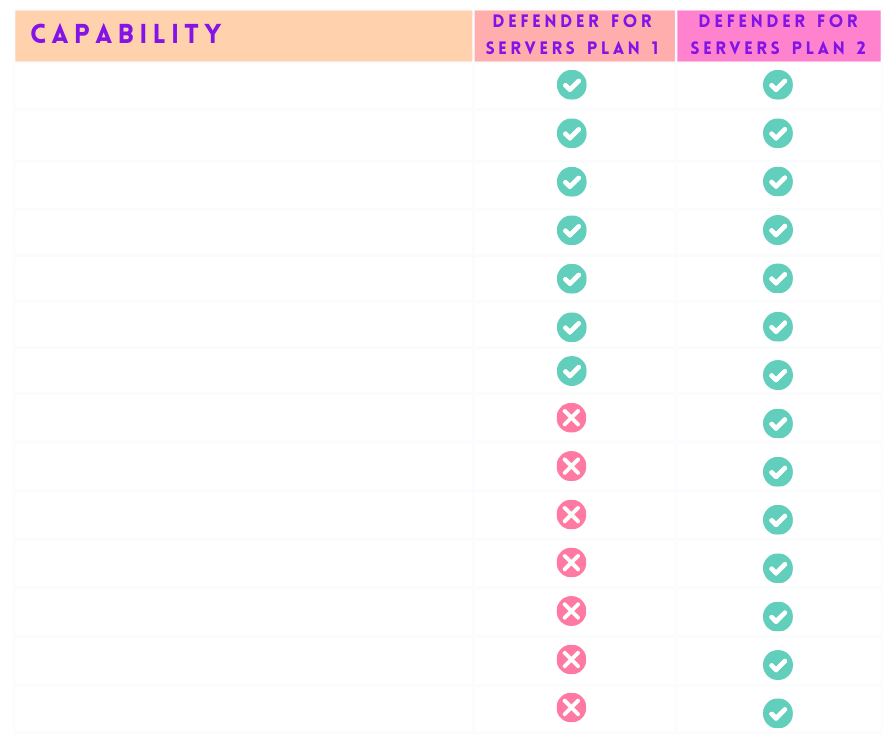

# DEFENDER FOR SERVERS

## Plan 1 & 2 Comparison

[source](https://learn.microsoft.com/en-us/defender-vulnerability-management/defender-vulnerability-management-capabilities)

[Vulnerability Assessment](https://learn.microsoft.com/en-us/defender-vulnerability-management/tvm-weaknesses)

[Configuration Assessment](https://learn.microsoft.com/en-us/defender-vulnerability-management/tvm-microsoft-secure-score-devices)

[Risk based prioritization](https://learn.microsoft.com/en-us/defender-vulnerability-management/tvm-security-recommendation)

[Remediation Tracking](https://learn.microsoft.com/en-us/defender-vulnerability-management/tvm-remediation)

[Continuous Monitoring](https://learn.microsoft.com/en-us/defender-endpoint/configure-vulnerability-email-notifications)

[Software Inventory](https://learn.microsoft.com/en-us/defender-vulnerability-management/tvm-software-inventory)

[Software Usage Insights](https://learn.microsoft.com/en-us/defender-vulnerability-management/tvm-usage-insights)

[Security baselines assessment](https://learn.microsoft.com/en-us/defender-vulnerability-management/tvm-security-baselines)

[Block vulnerable applications](https://learn.microsoft.com/en-us/defender-vulnerability-management/tvm-block-vuln-apps)

[Browser extensions assessment](https://learn.microsoft.com/en-us/defender-vulnerability-management/tvm-browser-extensions)

[Digital certificate assessment](https://learn.microsoft.com/en-us/defender-vulnerability-management/tvm-certificate-inventory)

[Network share analysis](https://learn.microsoft.com/en-us/defender-vulnerability-management/tvm-network-share-assessment)

[Hardware and firmware assessment](https://learn.microsoft.com/en-us/defender-vulnerability-management/tvm-hardware-and-firmware)

[Authenticated scan for Windows](https://learn.microsoft.com/en-us/defender-vulnerability-management/windows-authenticated-scan)

